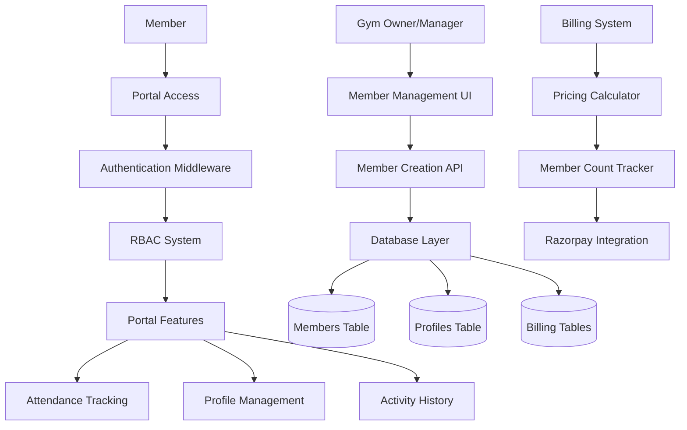
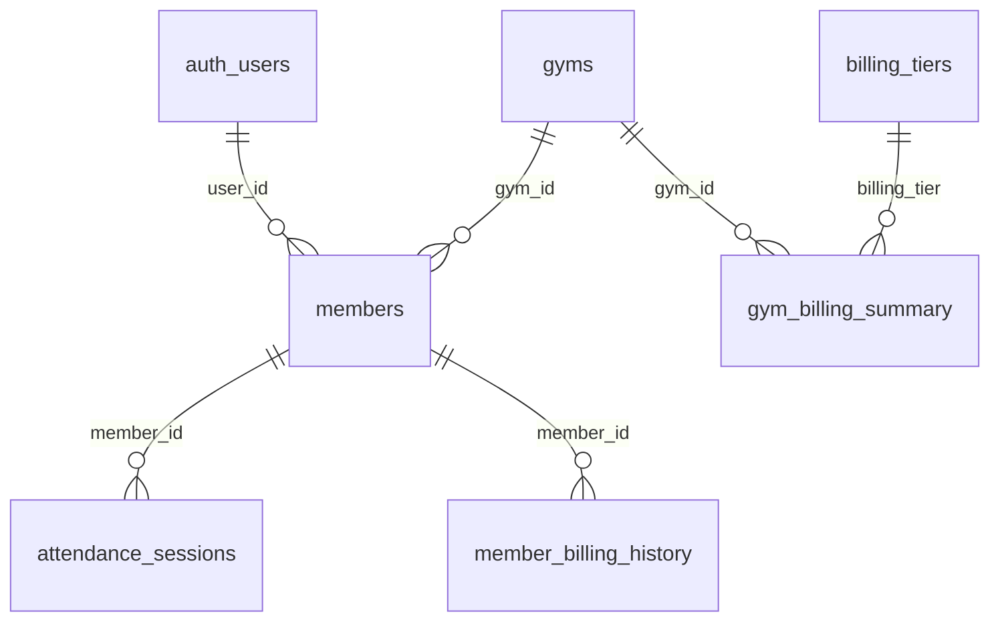

# Member Management & Billing Architecture Documentation

## Table of Contents

- [Overview](#overview)
- [System Architecture](#system-architecture)
- [Database Schema](#database-schema)
- [Member Management Flows](#member-management-flows)
- [Billing System](#billing-system)
- [Portal Access System](#portal-access-system)
- [API Endpoints](#api-endpoints)
- [Implementation Guide](#implementation-guide)
- [Optimization Strategies](#optimization-strategies)

---

## Overview

This document outlines the comprehensive member management and billing architecture for the Gym SaaS platform. The system provides a scalable, member-based pricing model that grows with gym businesses while maintaining excellent user experience.

### Key Features

- **Three-Flow Member Management**: Customer-only, Portal-invited, and Combined flows
- **Dynamic Member-Based Billing**: Pricing scales with member count
- **Secure Portal Access**: RBAC-based member portal with attendance tracking
- **Automated Billing Processing**: Monthly billing with tiered pricing
- **Real-time Analytics**: Member and billing insights for gym owners

---

## System Architecture

### High-Level Architecture



### Core Components

1. **Member Management System**
   - Member creation and management
   - Portal invitation system
   - Status tracking and updates

2. **Billing System**
   - Dynamic pricing calculator
   - Automated billing processing
   - Payment integration

3. **Portal Access System**
   - Authentication and authorization
   - Member dashboard
   - Attendance tracking

4. **Analytics System**
   - Member insights
   - Billing analytics
   - Usage tracking

---

## Database Schema

### Core Tables

#### Members Table
```sql
CREATE TABLE members (
  id UUID PRIMARY KEY DEFAULT gen_random_uuid(),
  gym_id UUID REFERENCES gyms(id) NOT NULL,
  user_id UUID REFERENCES auth.users(id) NULL, -- Portal access link
  first_name TEXT,
  last_name TEXT,
  email TEXT,
  phone_number TEXT,
  status TEXT DEFAULT 'active', -- active, inactive, pending
  join_date TIMESTAMP DEFAULT NOW(),
  
  -- Billing Integration
  billing_tier TEXT DEFAULT 'basic',
  is_billable BOOLEAN DEFAULT true,
  monthly_fee INTEGER DEFAULT 0, -- in paise
  last_billing_date TIMESTAMP,
  
  created_at TIMESTAMP DEFAULT NOW(),
  updated_at TIMESTAMP DEFAULT NOW()
);
```

#### Billing Tiers Table
```sql
CREATE TABLE billing_tiers (
  id UUID PRIMARY KEY DEFAULT gen_random_uuid(),
  name TEXT NOT NULL UNIQUE,
  display_name TEXT NOT NULL,
  base_price INTEGER NOT NULL, -- in paise
  member_pricing JSONB NOT NULL, -- tiered pricing structure
  member_limit INTEGER, -- null for unlimited
  features TEXT[],
  is_active BOOLEAN DEFAULT true,
  created_at TIMESTAMP DEFAULT NOW()
);
```

#### Gym Billing Summary
```sql
CREATE TABLE gym_billing_summary (
  id UUID PRIMARY KEY DEFAULT gen_random_uuid(),
  gym_id UUID REFERENCES gyms(id) UNIQUE,
  billing_tier TEXT NOT NULL,
  total_members INTEGER DEFAULT 0,
  billable_members INTEGER DEFAULT 0,
  base_fee INTEGER NOT NULL,
  member_fees INTEGER DEFAULT 0,
  total_monthly_fee INTEGER NOT NULL,
  last_calculated_at TIMESTAMP DEFAULT NOW(),
  created_at TIMESTAMP DEFAULT NOW()
);
```

#### Member Billing History
```sql
CREATE TABLE member_billing_history (
  id UUID PRIMARY KEY DEFAULT gen_random_uuid(),
  member_id UUID REFERENCES members(id),
  gym_id UUID REFERENCES gyms(id),
  billing_period_start DATE NOT NULL,
  billing_period_end DATE NOT NULL,
  member_fee INTEGER NOT NULL,
  status TEXT DEFAULT 'pending', -- pending, paid, failed
  razorpay_payment_id TEXT,
  created_at TIMESTAMP DEFAULT NOW()
);
```

### Relationships



---

## Member Management Flows

### Flow 1: Add Member Only (Customer Record)

**Use Case**: Gym owner adds a member without portal access

```typescript
interface AddMemberOnlyData {
  first_name: string
  last_name: string
  email?: string
  phone_number?: string
  status: 'active' | 'inactive' | 'pending'
  join_date?: string
}

// Implementation
export async function addMemberOnly({
  gymId,
  memberData
}: {
  gymId: string
  memberData: AddMemberOnlyData
}) {
  const member = await createMember({
    ...memberData,
    gym_id: gymId,
    user_id: null, // No portal access
    billing_tier: 'basic',
    is_billable: true
  })
  
  await updateGymBillingSummary(gymId)
  return member
}
```

### Flow 2: Invite to Portal (Existing Member)

**Use Case**: Gym owner invites existing member to portal

```typescript
interface PortalInvitationData {
  memberId: string
  email: string
  customMessage?: string
}

// Implementation
export async function inviteToPortal({
  memberId,
  email,
  customMessage
}: PortalInvitationData) {
  // Get member details
  const member = await getMember(memberId)
  
  // Create invitation with member context
  const invitation = await createInvitation({
    email,
    role: 'member',
    gym_id: member.gym_id,
    metadata: {
      member_id: memberId,
      member_name: `${member.first_name} ${member.last_name}`,
      portal_invitation: true,
      custom_message: customMessage
    }
  })
  
  return invitation
}
```

### Flow 3: Add Member + Portal (Combined)

**Use Case**: Gym owner adds member with immediate portal access

```typescript
interface AddMemberWithPortalData extends AddMemberOnlyData {
  send_portal_invitation: boolean
  custom_invitation_message?: string
}

// Implementation
export async function addMemberWithPortal({
  gymId,
  memberData
}: {
  gymId: string
  memberData: AddMemberWithPortalData
}) {
  // Create member record
  const member = await createMember({
    ...memberData,
    gym_id: gymId,
    user_id: null, // Will be linked after invitation acceptance
    billing_tier: 'basic',
    is_billable: true
  })
  
  // Send portal invitation if requested
  if (memberData.send_portal_invitation && memberData.email) {
    await inviteToPortal({
      memberId: member.id,
      email: memberData.email,
      customMessage: memberData.custom_invitation_message
    })
  }
  
  await updateGymBillingSummary(gymId)
  return member
}
```

---

## Billing System

### Dynamic Pricing Model

#### Billing Tiers Configuration

```typescript
const BILLING_TIERS = {
  starter: {
    name: 'Starter',
    base_price: 99900, // ₹999 in paise
    member_pricing: {
      first_50: 5000,    // ₹50 per member (first 50)
      next_100: 4000,    // ₹40 per member (51-150)
      next_200: 3000,    // ₹30 per member (151-350)
      beyond_350: 2000   // ₹20 per member (350+)
    },
    member_limit: 50,
    features: [
      'Member Management',
      'Basic Check-ins',
      'Simple Dashboard',
      'Mobile App Access',
      'Email Support'
    ]
  },
  professional: {
    name: 'Professional',
    base_price: 199900, // ₹1,999 in paise
    member_pricing: {
      first_50: 4500,    // ₹45 per member (first 50)
      next_100: 3500,    // ₹35 per member (51-150)
      next_200: 2500,    // ₹25 per member (151-350)
      beyond_350: 1500   // ₹15 per member (350+)
    },
    member_limit: 200,
    features: [
      'All Starter Features',
      'Advanced Analytics',
      'Member Growth Charts',
      'Revenue Tracking',
      'Email Notifications',
      'Check-in Trends',
      '12 Month Data Retention'
    ]
  },
  enterprise: {
    name: 'Enterprise',
    base_price: 499900, // ₹4,999 in paise
    member_pricing: {
      first_50: 4000,    // ₹40 per member (first 50)
      next_100: 3000,    // ₹30 per member (51-150)
      next_200: 2000,    // ₹20 per member (151-350)
      beyond_350: 1000   // ₹10 per member (350+)
    },
    member_limit: null, // unlimited
    features: [
      'All Professional Features',
      'API Access',
      'Multi-Gym Management',
      'Custom Reports',
      'Priority Support',
      'Advanced Retention Analytics',
      '36 Month Data Retention',
      'White-label Options'
    ]
  }
}
```

#### Pricing Calculator

```typescript
export async function calculateMemberFee(
  gymId: string,
  billingTier: string
): Promise<number> {
  const supabase = createClient()
  
  // Get current billable member count
  const { data: members } = await supabase
    .from('members')
    .select('id')
    .eq('gym_id', gymId)
    .eq('is_billable', true)
    .eq('status', 'active')
  
  const memberCount = members?.length || 0
  
  // Get billing tier configuration
  const { data: tier } = await supabase
    .from('billing_tiers')
    .select('*')
    .eq('name', billingTier)
    .single()
  
  if (!tier) throw new Error('Billing tier not found')
  
  // Calculate member fee based on tiered pricing
  const pricing = tier.member_pricing as any
  let memberFee = 0
  
  if (memberCount <= 50) {
    memberFee = memberCount * pricing.first_50
  } else if (memberCount <= 150) {
    memberFee = (50 * pricing.first_50) + ((memberCount - 50) * pricing.next_100)
  } else if (memberCount <= 350) {
    memberFee = (50 * pricing.first_50) + 
                (100 * pricing.next_100) + 
                ((memberCount - 150) * pricing.next_200)
  } else {
    memberFee = (50 * pricing.first_50) + 
                (100 * pricing.next_100) + 
                (200 * pricing.next_200) + 
                ((memberCount - 350) * pricing.beyond_350)
  }
  
  return memberFee
}
```

### Automated Billing Processing

```typescript
export async function processMonthlyBilling(gymId: string) {
  const supabase = createClient()
  
  // Get gym billing summary
  const { data: gymBilling } = await supabase
    .from('gym_billing_summary')
    .select('*')
    .eq('gym_id', gymId)
    .single()
  
  if (!gymBilling) throw new Error('Gym billing not configured')
  
  // Calculate total monthly fee
  const totalFee = gymBilling.base_fee + gymBilling.member_fees
  
  // Create Razorpay subscription
  const subscription = await createRazorpaySubscription({
    gymId,
    amount: totalFee,
    planId: gymBilling.billing_tier,
    billingCycle: 'monthly'
  })
  
  // Record billing history for each member
  const { data: members } = await supabase
    .from('members')
    .select('id, monthly_fee')
    .eq('gym_id', gymId)
    .eq('is_billable', true)
    .eq('status', 'active')
  
  for (const member of members || []) {
    await supabase
      .from('member_billing_history')
      .insert({
        member_id: member.id,
        gym_id: gymId,
        billing_period_start: new Date().toISOString(),
        billing_period_end: new Date(Date.now() + 30 * 24 * 60 * 60 * 1000).toISOString(),
        member_fee: member.monthly_fee,
        status: 'pending'
      })
  }
  
  return subscription
}
```

---

## Portal Access System

### Authentication & Authorization

#### Middleware Configuration

```typescript
// Portal route protection
export async function middleware(request: NextRequest) {
  const { pathname } = request.nextUrl
  
  // Check if route is portal route
  if (pathname.startsWith('/portal')) {
    const user = await getUser(request)
    
    if (!user) {
      return NextResponse.redirect(new URL('/login', request.url))
    }
    
    // Check if user has member role
    const profile = await getUserProfile(user.id)
    const role = await getUserRole(user.id, profile.gym_id)
    
    if (role !== 'member') {
      return NextResponse.redirect(new URL('/dashboard', request.url))
    }
    
    return NextResponse.next()
  }
}
```

#### RBAC Integration

```typescript
// Member role permissions
const MEMBER_PERMISSIONS = [
  'activities.create', // Check-in/out
  'activities.read',   // View own attendance
  'members.read_own',  // View own profile
  'gyms.read'          // View gym info
]

// Check member permissions
export async function checkMemberPermission(
  userId: string,
  permission: string
): Promise<boolean> {
  const supabase = createClient()
  
  const { data: role } = await supabase
    .from('user_roles')
    .select(`
      roles(permissions)
    `)
    .eq('user_id', userId)
    .eq('role_name', 'member')
    .single()
  
  if (!role) return false
  
  const permissions = role.roles.permissions as string[]
  return permissions.includes(permission)
}
```

### Portal Features

#### Member Dashboard

```typescript
export function MemberDashboard() {
  const { data: portalData, isLoading } = useMemberPortal()
  const { member, attendance, billingInfo } = portalData || {}
  
  if (isLoading) return <MemberDashboardSkeleton />
  
  return (
    <div className="space-y-6">
      {/* Billing Status Card */}
      <BillingStatusCard 
        tier={billingInfo.tier}
        monthlyFee={billingInfo.monthlyFee}
        lastBilling={billingInfo.lastBilling}
      />
      
      {/* Quick Actions */}
      <QuickActionsCard 
        memberId={member.id}
        currentStatus={getCurrentCheckInStatus(attendance)}
      />
      
      {/* Recent Activity */}
      <RecentActivityCard attendance={attendance} />
      
      {/* Membership Details */}
      <MembershipDetailsCard member={member} />
    </div>
  )
}
```

#### Attendance Tracking

```typescript
// Check-in/Check-out API
export async function POST(request: NextRequest) {
  const { action, notes } = await request.json()
  const user = await getUser(request)
  
  if (!user) {
    return NextResponse.json({ error: 'Unauthorized' }, { status: 401 })
  }
  
  // Get member ID from user
  const { data: member } = await supabase
    .from('members')
    .select('id, gym_id')
    .eq('user_id', user.id)
    .single()
  
  if (!member) {
    return NextResponse.json({ error: 'Member not found' }, { status: 404 })
  }
  
  if (action === 'checkin') {
    const session = await startAttendanceSession({
      memberId: member.id,
      gymId: member.gym_id,
      method: 'pwa',
      notes
    })
    
    return NextResponse.json({ session })
  }
  
  if (action === 'checkout') {
    const session = await endAttendanceSession({
      memberId: member.id,
      gymId: member.gym_id
    })
    
    return NextResponse.json({ session })
  }
}
```

---

## API Endpoints

### Member Management APIs

#### POST /api/members
Create a new member

**Request Body:**
```json
{
  "first_name": "John",
  "last_name": "Doe",
  "email": "john@example.com",
  "phone_number": "+1234567890",
  "status": "active",
  "billing_tier": "basic",
  "send_portal_invitation": true
}
```

**Response:**
```json
{
  "id": "uuid",
  "first_name": "John",
  "last_name": "Doe",
  "email": "john@example.com",
  "phone_number": "+1234567890",
  "status": "active",
  "gym_id": "uuid",
  "user_id": null,
  "billing_tier": "basic",
  "monthly_fee": 5000,
  "created_at": "2024-01-01T00:00:00Z"
}
```

#### POST /api/members/{id}/invite-portal
Invite existing member to portal

**Request Body:**
```json
{
  "email": "john@example.com",
  "custom_message": "Welcome to our member portal!"
}
```

**Response:**
```json
{
  "success": true,
  "invitation_id": "uuid",
  "message": "Portal invitation sent successfully"
}
```

### Billing APIs

#### GET /api/billing/summary
Get gym billing summary

**Response:**
```json
{
  "gym_id": "uuid",
  "billing_tier": "professional",
  "total_members": 150,
  "billable_members": 145,
  "base_fee": 199900,
  "member_fees": 435000,
  "total_monthly_fee": 634900,
  "last_calculated_at": "2024-01-01T00:00:00Z"
}
```

#### POST /api/billing/process
Process monthly billing

**Response:**
```json
{
  "success": true,
  "subscription_id": "sub_xyz",
  "total_amount": 634900,
  "member_count": 145,
  "billing_period": "2024-01-01 to 2024-01-31"
}
```

### Portal APIs

#### GET /api/portal/me
Get member portal data

**Response:**
```json
{
  "member": {
    "id": "uuid",
    "first_name": "John",
    "last_name": "Doe",
    "email": "john@example.com",
    "status": "active",
    "billing_tier": "basic",
    "monthly_fee": 5000
  },
  "attendance": [
    {
      "id": "uuid",
      "check_in_at": "2024-01-01T09:00:00Z",
      "check_out_at": "2024-01-01T11:00:00Z",
      "method": "pwa"
    }
  ],
  "billing_info": {
    "tier": "basic",
    "monthly_fee": 5000,
    "last_billing": {
      "billing_period_start": "2024-01-01",
      "billing_period_end": "2024-01-31",
      "status": "paid"
    }
  }
}
```

#### POST /api/portal/checkin
Member check-in

**Request Body:**
```json
{
  "notes": "Morning workout"
}
```

**Response:**
```json
{
  "success": true,
  "session_id": "uuid",
  "check_in_at": "2024-01-01T09:00:00Z"
}
```

#### POST /api/portal/checkout
Member check-out

**Response:**
```json
{
  "success": true,
  "session_id": "uuid",
  "check_out_at": "2024-01-01T11:00:00Z",
  "duration_minutes": 120
}
```

---

## Implementation Guide

### Phase 1: Database Setup

1. **Create billing tables**
```sql
-- Run migration scripts
-- 1. Create billing_tiers table
-- 2. Create gym_billing_summary table
-- 3. Create member_billing_history table
-- 4. Add billing columns to members table
```

2. **Insert billing tier data**
```sql
INSERT INTO billing_tiers (name, display_name, base_price, member_pricing, member_limit, features)
VALUES 
('starter', 'Starter', 99900, '{"first_50": 5000, "next_100": 4000, "next_200": 3000, "beyond_350": 2000}', 50, '["Member Management", "Basic Check-ins", "Simple Dashboard"]'),
('professional', 'Professional', 199900, '{"first_50": 4500, "next_100": 3500, "next_200": 2500, "beyond_350": 1500}', 200, '["All Starter Features", "Advanced Analytics", "Revenue Tracking"]'),
('enterprise', 'Enterprise', 499900, '{"first_50": 4000, "next_100": 3000, "next_200": 2000, "beyond_350": 1000}', null, '["All Professional Features", "API Access", "Multi-Gym Management"]');
```

### Phase 2: API Implementation

1. **Create billing service**
```typescript
// src/services/billing.service.ts
export class BillingService {
  async calculateMemberFee(gymId: string, billingTier: string): Promise<number>
  async updateGymBillingSummary(gymId: string): Promise<void>
  async processMonthlyBilling(gymId: string): Promise<BillingResult>
  async getBillingHistory(gymId: string): Promise<BillingHistory[]>
}
```

2. **Create member service**
```typescript
// src/services/member.service.ts
export class MemberService {
  async createMember(data: CreateMemberData): Promise<Member>
  async inviteToPortal(data: PortalInvitationData): Promise<Invitation>
  async updateMemberBilling(memberId: string, billingTier: string): Promise<void>
  async getMemberPortalData(userId: string): Promise<MemberPortalData>
}
```

### Phase 3: UI Components

1. **Enhanced member management**
```typescript
// src/components/members/EnhancedMemberDialog.tsx
export function EnhancedMemberDialog({
  open,
  onOpenChange,
  mode,
  memberData
}: EnhancedMemberDialogProps) {
  const [billingTier, setBillingTier] = useState('basic')
  const [sendPortalInvitation, setSendPortalInvitation] = useState(false)
  
  // Implementation with billing integration
}
```

2. **Billing dashboard**
```typescript
// src/components/billing/BillingDashboard.tsx
export function BillingDashboard({ gymId }: { gymId: string }) {
  const { data: billingSummary } = useBillingSummary(gymId)
  const { data: billingHistory } = useBillingHistory(gymId)
  
  // Implementation with billing analytics
}
```

### Phase 4: Portal Enhancement

1. **Member portal with billing context**
```typescript
// src/app/(portal)/dashboard/page.tsx
export default function MemberDashboard() {
  const { data: portalData } = useMemberPortal()
  
  return (
    <div className="space-y-6">
      <BillingStatusCard billingInfo={portalData.billingInfo} />
      <QuickActionsCard memberId={portalData.member.id} />
      <RecentActivityCard attendance={portalData.attendance} />
    </div>
  )
}
```

---

## Optimization Strategies

### Performance Optimizations

1. **Database Indexing**
```sql
-- Add indexes for better performance
CREATE INDEX idx_members_gym_billing ON members(gym_id, is_billable, status);
CREATE INDEX idx_billing_history_member ON member_billing_history(member_id, billing_period_start);
CREATE INDEX idx_gym_billing_summary_gym ON gym_billing_summary(gym_id);
```

2. **Caching Strategy**
```typescript
// Cache billing calculations
const BILLING_CACHE_TTL = 5 * 60 * 1000 // 5 minutes

export async function getCachedBillingSummary(gymId: string) {
  const cacheKey = `billing_summary_${gymId}`
  
  // Check cache first
  const cached = await redis.get(cacheKey)
  if (cached) return JSON.parse(cached)
  
  // Calculate and cache
  const summary = await calculateBillingSummary(gymId)
  await redis.setex(cacheKey, BILLING_CACHE_TTL, JSON.stringify(summary))
  
  return summary
}
```

3. **Background Processing**
```typescript
// Process billing in background
export async function scheduleMonthlyBilling() {
  const gyms = await getActiveGyms()
  
  for (const gym of gyms) {
    await addToQueue('monthly_billing', {
      gymId: gym.id,
      scheduledFor: getNextBillingDate()
    })
  }
}
```

### Scalability Considerations

1. **Horizontal Scaling**
   - Use read replicas for analytics queries
   - Implement database sharding by gym_id
   - Cache frequently accessed data

2. **Rate Limiting**
   - Implement rate limits for billing calculations
   - Queue heavy operations
   - Use background jobs for bulk operations

3. **Monitoring**
   - Track billing calculation performance
   - Monitor member creation rates
   - Alert on billing failures

---

## Security Considerations

### Data Protection

1. **RLS Policies**
```sql
-- Members can only see their own data
CREATE POLICY members_read_own ON members
  FOR SELECT USING (user_id = auth.uid());

-- Staff can manage their gym's members
CREATE POLICY members_manage_gym ON members
  FOR ALL USING (
    gym_id IN (
      SELECT gym_id FROM profiles WHERE id = auth.uid()
    )
  );
```

2. **API Security**
   - Validate all inputs
   - Implement rate limiting
   - Use HTTPS for all communications
   - Sanitize user data

3. **Billing Security**
   - Encrypt sensitive billing data
   - Implement audit trails
   - Use secure payment processing
   - Regular security audits

---

## Monitoring & Analytics

### Key Metrics

1. **Member Metrics**
   - Member acquisition rate
   - Portal adoption rate
   - Member retention rate
   - Average member value

2. **Billing Metrics**
   - Monthly recurring revenue (MRR)
   - Average revenue per user (ARPU)
   - Billing success rate
   - Churn rate

3. **System Metrics**
   - API response times
   - Database query performance
   - Error rates
   - User engagement

### Dashboard Implementation

```typescript
// src/components/analytics/BillingAnalytics.tsx
export function BillingAnalytics({ gymId }: { gymId: string }) {
  const { data: metrics } = useBillingMetrics(gymId)
  
  return (
    <div className="grid grid-cols-1 md:grid-cols-3 gap-6">
      <MetricCard
        title="Monthly Revenue"
        value={formatCurrency(metrics.monthlyRevenue)}
        change={metrics.revenueChange}
      />
      <MetricCard
        title="Member Count"
        value={metrics.memberCount}
        change={metrics.memberChange}
      />
      <MetricCard
        title="ARPU"
        value={formatCurrency(metrics.arpu)}
        change={metrics.arpuChange}
      />
    </div>
  )
}
```

---

## Conclusion

This comprehensive member management and billing architecture provides:

- **Scalable Pricing**: Member-based pricing that grows with gym businesses
- **Flexible Management**: Three distinct member management flows
- **Secure Portal Access**: RBAC-based member portal with full attendance tracking
- **Automated Billing**: Monthly billing processing with tiered pricing
- **Real-time Analytics**: Comprehensive insights for gym owners

The system is designed to be maintainable, scalable, and secure while providing excellent user experience for both gym owners and members.
