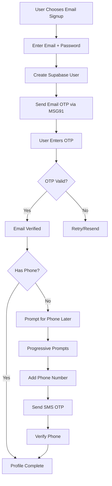
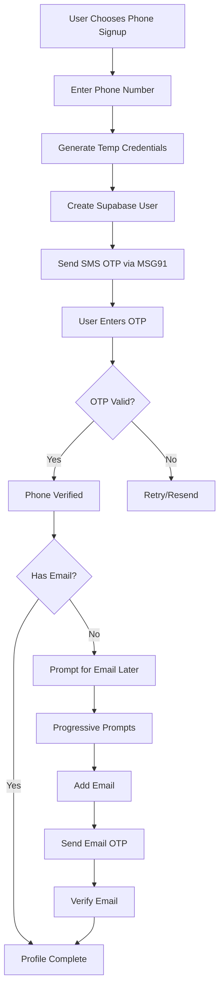
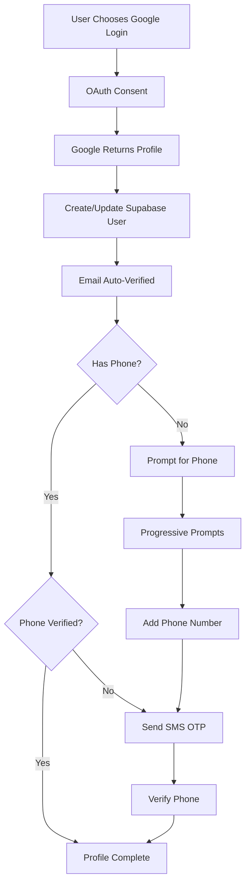

# Progressive Authentication & Profile Verification System

## Overview

This document outlines a flexible authentication system that allows users to sign up using email, phone, or social login (Google), with progressive profile completion and verification. The system is designed to minimize signup friction while ensuring all users eventually provide and verify both email and phone numbers.

## Table of Contents

1. [Architecture Overview](#architecture-overview)
2. [User Journey Flows](#user-journey-flows)
3. [Database Schema](#database-schema)
4. [Implementation Details](#implementation-details)
5. [Prompt Conditions System](#prompt-conditions-system)
6. [Verification States](#verification-states)
7. [Security Considerations](#security-considerations)
8. [API Endpoints](#api-endpoints)
9. [UI Components](#ui-components)
10. [Testing Strategy](#testing-strategy)

## Architecture Overview

### Core Principles

1. **Low Friction Entry**: Users can start with any authentication method
2. **Progressive Enhancement**: Collect additional information over time
3. **Smart Prompting**: Context-aware reminders that don't annoy users
4. **Value-Driven**: Show benefits of completing profile
5. **Security First**: Maintain Supabase RLS and security standards

### System Components

```
┌─────────────────────────────────────────────────────────────┐
│                    Authentication Layer                      │
├─────────────────────────────────────────────────────────────┤
│  Email + OTP  │  Phone + OTP  │  Google OAuth               │  
└───────────────┬─────────────────────────────────┬───────────┘
                │                                 │
                ▼                                 ▼
┌─────────────────────────┐       ┌─────────────────────────┐
│   Supabase Auth Core    │       │    MSG91 Services       │
│  • Session Management   │       │  • Email OTP            │
│  • Token Generation     │       │  • SMS OTP              │
│  • RLS Integration      │       │  • WhatsApp (Tier 2+)   │
└─────────────────────────┘       └─────────────────────────┘
                │                                 │
                └─────────────────┬───────────────┘
                                  ▼
                    ┌─────────────────────────┐
                    │  Profile Verification   │
                    │    State Machine        │
                    └─────────────────────────┘
```

## User Journey Flows

### 1. Email Signup Flow



### 2. Phone Signup Flow (Passwordless)



### 3. Google OAuth Flow



## Database Schema

### Enhanced Tables

```sql
-- Enhanced profiles table with verification tracking
CREATE TABLE profiles (
  id UUID PRIMARY KEY REFERENCES auth.users(id),
  email TEXT,
  phone_number TEXT,
  full_name TEXT,
  gym_id UUID REFERENCES gyms(id),
  
  -- Verification status
  email_verified BOOLEAN DEFAULT FALSE,
  phone_verified BOOLEAN DEFAULT FALSE,
  email_verified_at TIMESTAMP,
  phone_verified_at TIMESTAMP,
  
  -- Verification state tracking
  verification_state TEXT DEFAULT 'unverified',
  initial_auth_method TEXT CHECK (initial_auth_method IN ('email', 'phone', 'google')),
  
  -- Profile completion
  profile_completion_score INTEGER DEFAULT 0,
  last_completion_prompt TIMESTAMP,
  
  -- Metadata
  created_at TIMESTAMP DEFAULT NOW(),
  updated_at TIMESTAMP DEFAULT NOW()
);

-- Unique constraints for verified contacts only
CREATE UNIQUE INDEX idx_verified_email ON profiles(email) WHERE email_verified = true;
CREATE UNIQUE INDEX idx_verified_phone ON profiles(phone_number) WHERE phone_verified = true;

-- OTP verification tracking
CREATE TABLE otp_verifications (
  id UUID PRIMARY KEY DEFAULT gen_random_uuid(),
  user_id UUID REFERENCES auth.users(id),
  contact_method TEXT CHECK (contact_method IN ('email', 'phone')),
  contact_value TEXT NOT NULL,
  otp_hash TEXT NOT NULL,
  purpose TEXT CHECK (purpose IN ('signup', 'login', 'verification', '2fa')),
  
  -- Security tracking
  attempts INTEGER DEFAULT 0,
  max_attempts INTEGER DEFAULT 5,
  expires_at TIMESTAMP NOT NULL,
  verified_at TIMESTAMP,
  
  -- Rate limiting
  ip_address INET,
  user_agent TEXT,
  
  created_at TIMESTAMP DEFAULT NOW()
);

-- Index for fast lookups and cleanup
CREATE INDEX idx_otp_lookup ON otp_verifications(contact_value, expires_at) WHERE verified_at IS NULL;
CREATE INDEX idx_otp_cleanup ON otp_verifications(expires_at) WHERE verified_at IS NULL;

-- Profile completion prompts tracking
CREATE TABLE profile_completion_prompts (
  id UUID PRIMARY KEY DEFAULT gen_random_uuid(),
  user_id UUID REFERENCES auth.users(id),
  prompt_type TEXT CHECK (prompt_type IN ('add_phone', 'add_email', 'verify_phone', 'verify_email', 'complete_profile')),
  prompt_context TEXT, -- Where/why the prompt was shown
  
  -- User response
  shown_at TIMESTAMP DEFAULT NOW(),
  dismissed_at TIMESTAMP,
  completed_at TIMESTAMP,
  skip_count INTEGER DEFAULT 0,
  
  -- A/B testing
  prompt_variant TEXT,
  conversion_time_seconds INTEGER
);

-- Profile completion incentives
CREATE TABLE profile_incentives (
  id UUID PRIMARY KEY DEFAULT gen_random_uuid(),
  user_id UUID REFERENCES auth.users(id),
  incentive_type TEXT CHECK (incentive_type IN ('extended_trial', 'feature_unlock', 'discount', 'bonus_credits')),
  incentive_value JSONB,
  
  -- Conditions
  triggered_by TEXT, -- What verification triggered this
  
  -- Redemption
  granted_at TIMESTAMP DEFAULT NOW(),
  redeemed_at TIMESTAMP,
  expires_at TIMESTAMP
);
```

### Verification State Enum

```sql
-- Verification states
CREATE TYPE user_verification_state AS ENUM (
  'unverified',           -- No verification done
  'email_only',          -- Only email verified
  'phone_only',          -- Only phone verified
  'google_only',         -- Google email verified, no phone
  'fully_verified',      -- Both email and phone verified
  'pending_email',       -- Has email, not verified
  'pending_phone'        -- Has phone, not verified
);
```

## Implementation Details

### 1. Flexible Signup Actions

```typescript
// src/actions/auth.actions.ts

interface SignupResult {
  success: boolean
  userId?: string
  requiresOTP?: boolean
  otpChannel?: 'email' | 'phone'
  maskedContact?: string
  error?: string
  nextStep?: 'verify_otp' | 'add_email' | 'add_phone' | 'complete'
}

// Email signup with OTP
export async function signupWithEmailOTP(
  email: string,
  password: string,
  options?: {
    phoneNumber?: string // Optional phone during signup
    referralCode?: string
  }
): Promise<SignupResult> {
  const supabase = await createClient()
  
  try {
    // Validate inputs
    const emailValid = validateInput.email(email)
    if (!emailValid) {
      return { success: false, error: 'Invalid email format' }
    }
    
    // Create Supabase user without email confirmation
    const { data: authData, error: authError } = await supabase.auth.signUp({
      email,
      password,
      options: {
        emailRedirectTo: undefined, // Skip Supabase email
        data: {
          initial_auth_method: 'email',
          verification_state: 'pending_email',
          phone_number: options?.phoneNumber,
          referral_code: options?.referralCode
        }
      }
    })
    
    if (authError) {
      return { success: false, error: authError.message }
    }
    
    // Send OTP via MSG91
    const otpService = getOtpService()
    const { success: otpSent } = await otpService.sendOtp({
      contact: email,
      type: 'email',
      template: 'signup_verification'
    })
    
    if (!otpSent) {
      // Rollback user creation if OTP fails
      await supabase.auth.admin.deleteUser(authData.user!.id)
      return { success: false, error: 'Failed to send verification code' }
    }
    
    // Track signup event
    await trackEvent('signup_initiated', {
      method: 'email',
      userId: authData.user!.id
    })
    
    return {
      success: true,
      userId: authData.user!.id,
      requiresOTP: true,
      otpChannel: 'email',
      maskedContact: maskEmail(email),
      nextStep: 'verify_otp'
    }
  } catch (error) {
    logger.error('Email signup error:', error)
    return { success: false, error: 'Signup failed. Please try again.' }
  }
}

// Phone signup (passwordless)
export async function signupWithPhoneOTP(
  phoneNumber: string,
  options?: {
    email?: string // Optional email during signup
    countryCode?: string
  }
): Promise<SignupResult> {
  const supabase = await createClient()
  
  try {
    // Validate and format phone number
    const formattedPhone = formatPhoneNumber(phoneNumber, options?.countryCode)
    if (!validateInput.phone(formattedPhone)) {
      return { success: false, error: 'Invalid phone number' }
    }
    
    // Check if phone already exists
    const { data: existingProfile } = await supabase
      .from('profiles')
      .select('id')
      .eq('phone_number', formattedPhone)
      .eq('phone_verified', true)
      .single()
    
    if (existingProfile) {
      return { success: false, error: 'Phone number already registered' }
    }
    
    // Generate temporary credentials for Supabase
    const tempEmail = generateTempEmail(formattedPhone)
    const tempPassword = generateSecurePassword()
    
    // Create Supabase user
    const { data: authData, error: authError } = await supabase.auth.signUp({
      email: tempEmail,
      password: tempPassword,
      options: {
        data: {
          initial_auth_method: 'phone',
          verification_state: 'pending_phone',
          phone_number: formattedPhone,
          actual_email: options?.email,
          is_passwordless: true,
          temp_credentials: true
        }
      }
    })
    
    if (authError) {
      return { success: false, error: authError.message }
    }
    
    // Store temp credentials securely for later conversion
    await storeTemporaryCredentials(authData.user!.id, {
      tempEmail,
      tempPassword,
      expiresAt: Date.now() + 24 * 60 * 60 * 1000 // 24 hours
    })
    
    // Send OTP via MSG91
    const otpService = getOtpService()
    const { success: otpSent } = await otpService.sendOtp({
      contact: formattedPhone,
      type: 'sms',
      template: 'signup_verification'
    })
    
    if (!otpSent) {
      await supabase.auth.admin.deleteUser(authData.user!.id)
      return { success: false, error: 'Failed to send verification code' }
    }
    
    return {
      success: true,
      userId: authData.user!.id,
      requiresOTP: true,
      otpChannel: 'phone',
      maskedContact: maskPhoneNumber(formattedPhone),
      nextStep: 'verify_otp'
    }
  } catch (error) {
    logger.error('Phone signup error:', error)
    return { success: false, error: 'Signup failed. Please try again.' }
  }
}

// Google OAuth with phone collection
export async function signupWithGoogle(
  options?: {
    inviteToken?: string
    intendedPlan?: string
  }
) {
  const supabase = await createClient()
  const origin = getAppUrl()
  
  // Build redirect URL with metadata
  const redirectUrl = new URL(`${origin}/auth/callback`)
  if (options?.inviteToken) {
    redirectUrl.searchParams.set('invite', options.inviteToken)
  }
  if (options?.intendedPlan) {
    redirectUrl.searchParams.set('plan', options.intendedPlan)
  }
  redirectUrl.searchParams.set('next', '/onboarding/verify-phone')
  
  const { data, error } = await supabase.auth.signInWithOAuth({
    provider: 'google',
    options: {
      redirectTo: redirectUrl.toString(),
      scopes: 'email profile',
      queryParams: {
        access_type: 'offline',
        prompt: 'consent'
      }
    }
  })
  
  if (error) {
    return { success: false, error: error.message }
  }
  
  return { success: true, authUrl: data.url }
}
```

### 2. OTP Verification System

```typescript
// src/app/api/auth/verify-otp/route.ts

interface VerifyOTPRequest {
  userId: string
  otp: string
  contact: string
  contactType: 'email' | 'phone'
}

export async function POST(request: Request) {
  try {
    const body: VerifyOTPRequest = await request.json()
    const { userId, otp, contact, contactType } = body
    
    // Rate limiting check
    const rateLimitKey = `otp_verify:${contact}`
    const isRateLimited = await checkRateLimit(rateLimitKey, {
      maxAttempts: 5,
      windowMinutes: 15
    })
    
    if (isRateLimited) {
      return NextResponse.json(
        { error: 'Too many attempts. Please try again later.' },
        { status: 429 }
      )
    }
    
    // Get OTP record
    const supabase = await createClient()
    const { data: otpRecord } = await supabase
      .from('otp_verifications')
      .select('*')
      .eq('user_id', userId)
      .eq('contact_value', contact)
      .eq('contact_method', contactType)
      .gt('expires_at', new Date().toISOString())
      .is('verified_at', null)
      .order('created_at', { ascending: false })
      .limit(1)
      .single()
    
    if (!otpRecord) {
      await incrementRateLimit(rateLimitKey)
      return NextResponse.json(
        { error: 'Invalid or expired verification code' },
        { status: 400 }
      )
    }
    
    // Check attempts
    if (otpRecord.attempts >= otpRecord.max_attempts) {
      return NextResponse.json(
        { error: 'Maximum attempts exceeded. Please request a new code.' },
        { status: 400 }
      )
    }
    
    // Verify OTP
    const isValid = await verifyOTPHash(otp, otpRecord.otp_hash)
    
    if (!isValid) {
      // Increment attempts
      await supabase
        .from('otp_verifications')
        .update({ attempts: otpRecord.attempts + 1 })
        .eq('id', otpRecord.id)
      
      await incrementRateLimit(rateLimitKey)
      
      return NextResponse.json(
        { error: 'Invalid verification code' },
        { status: 400 }
      )
    }
    
    // Mark OTP as verified
    await supabase
      .from('otp_verifications')
      .update({ verified_at: new Date().toISOString() })
      .eq('id', otpRecord.id)
    
    // Update user profile based on contact type
    const profileUpdate = contactType === 'email'
      ? {
          email: contact,
          email_verified: true,
          email_verified_at: new Date().toISOString()
        }
      : {
          phone_number: contact,
          phone_verified: true,
          phone_verified_at: new Date().toISOString()
        }
    
    // Update profile
    await supabase
      .from('profiles')
      .update(profileUpdate)
      .eq('id', userId)
    
    // Update verification state
    const { data: profile } = await supabase
      .from('profiles')
      .select('email_verified, phone_verified')
      .eq('id', userId)
      .single()
    
    const newVerificationState = getVerificationState(profile)
    
    await supabase
      .from('profiles')
      .update({ 
        verification_state: newVerificationState,
        profile_completion_score: calculateCompletionScore(profile)
      })
      .eq('id', userId)
    
    // If using Supabase Admin, update auth metadata
    const supabaseAdmin = createAdminClient()
    await supabaseAdmin.auth.admin.updateUserById(userId, {
      email_confirmed_at: contactType === 'email' ? new Date().toISOString() : undefined,
      user_metadata: {
        [`${contactType}_verified`]: true,
        [`${contactType}_verified_at`]: new Date().toISOString(),
        verification_state: newVerificationState
      }
    })
    
    // Grant incentives if applicable
    if (newVerificationState === 'fully_verified') {
      await grantVerificationIncentives(userId, 'full_verification')
    } else {
      await grantVerificationIncentives(userId, `${contactType}_verification`)
    }
    
    // Track event
    await trackEvent('verification_completed', {
      userId,
      contactType,
      verificationState: newVerificationState
    })
    
    // Determine next step
    const nextStep = determineNextStep(profile, newVerificationState)
    
    return NextResponse.json({
      success: true,
      verificationState: newVerificationState,
      nextStep,
      message: getSuccessMessage(contactType, newVerificationState)
    })
    
  } catch (error) {
    logger.error('OTP verification error:', error)
    return NextResponse.json(
      { error: 'Verification failed. Please try again.' },
      { status: 500 }
    )
  }
}

// Helper functions
function getVerificationState(profile: any): string {
  if (profile.email_verified && profile.phone_verified) {
    return 'fully_verified'
  }
  if (profile.email_verified && !profile.phone_verified) {
    return 'email_only'
  }
  if (!profile.email_verified && profile.phone_verified) {
    return 'phone_only'
  }
  return 'unverified'
}

function calculateCompletionScore(profile: any): number {
  let score = 0
  if (profile.email_verified) score += 40
  if (profile.phone_verified) score += 40
  if (profile.full_name) score += 10
  if (profile.gym_id) score += 10
  return score
}

function determineNextStep(profile: any, verificationState: string): string {
  if (verificationState === 'fully_verified') {
    return profile.gym_id ? 'dashboard' : 'onboarding'
  }
  if (verificationState === 'email_only') {
    return 'add_phone'
  }
  if (verificationState === 'phone_only') {
    return 'add_email'
  }
  return 'complete_profile'
}
```

## Prompt Conditions System

### Overview

The prompt conditions system determines when and how to remind users to complete their profile verification. It uses multiple factors to ensure prompts are shown at optimal times without being intrusive.

### 1. Time-Based Conditions

```typescript
// src/lib/prompt-conditions.ts

export interface TimeConditions {
  minAccountAge: number        // Minimum time after signup
  cooldownPeriod: number       // Time between prompts
  businessHours?: {           // Optional: Only during certain hours
    start: number
    end: number
    timezone: string
  }
  blackoutDates?: Date[]      // Don't prompt on specific dates
}

export const DEFAULT_TIME_CONDITIONS: TimeConditions = {
  minAccountAge: 24 * 60 * 60 * 1000,      // 24 hours
  cooldownPeriod: 7 * 24 * 60 * 60 * 1000, // 7 days
  businessHours: {
    start: 9,
    end: 18,
    timezone: 'local'
  }
}

export function checkTimeConditions(
  profile: Profile,
  lastPrompt?: Date,
  conditions: TimeConditions = DEFAULT_TIME_CONDITIONS
): boolean {
  const now = new Date()
  
  // Check account age
  const accountAge = now.getTime() - new Date(profile.created_at).getTime()
  if (accountAge < conditions.minAccountAge) {
    return false
  }
  
  // Check cooldown period
  if (lastPrompt) {
    const timeSinceLastPrompt = now.getTime() - lastPrompt.getTime()
    if (timeSinceLastPrompt < conditions.cooldownPeriod) {
      return false
    }
  }
  
  // Check business hours if configured
  if (conditions.businessHours) {
    const currentHour = now.getHours()
    if (currentHour < conditions.businessHours.start || 
        currentHour >= conditions.businessHours.end) {
      return false
    }
  }
  
  // Check blackout dates
  if (conditions.blackoutDates?.some(date => 
    date.toDateString() === now.toDateString()
  )) {
    return false
  }
  
  return true
}
```

### 2. Behavior-Based Conditions

```typescript
// src/lib/prompt-conditions.ts

export interface BehaviorConditions {
  minSessionDuration: number      // Minimum time user has been active
  minActionsInSession: number     // Minimum actions taken
  triggerActions: string[]        // Actions that trigger prompts
  blockingActions: string[]       // Actions that prevent prompts
  minEngagementScore: number      // Minimum engagement level
}

export const DEFAULT_BEHAVIOR_CONDITIONS: BehaviorConditions = {
  minSessionDuration: 3 * 60 * 1000,  // 3 minutes
  minActionsInSession: 3,
  triggerActions: [
    'view_dashboard',
    'complete_workout',
    'add_member',
    'view_settings'
  ],
  blockingActions: [
    'process_payment',
    'export_data',
    'delete_member',
    'change_password'
  ],
  minEngagementScore: 3
}

export async function checkBehaviorConditions(
  userId: string,
  currentAction: string,
  conditions: BehaviorConditions = DEFAULT_BEHAVIOR_CONDITIONS
): Promise<boolean> {
  // Don't show during blocking actions
  if (conditions.blockingActions.includes(currentAction)) {
    return false
  }
  
  // Get current session data
  const session = await getSessionData(userId)
  
  // Check session duration
  if (session.duration < conditions.minSessionDuration) {
    return false
  }
  
  // Check action count
  if (session.actionCount < conditions.minActionsInSession) {
    return false
  }
  
  // Check if current action is a trigger
  const isTriggerAction = conditions.triggerActions.includes(currentAction)
  
  // Calculate engagement score
  const engagementScore = calculateEngagementScore(session)
  if (engagementScore < conditions.minEngagementScore) {
    return false
  }
  
  return isTriggerAction || session.actionCount > 5
}

function calculateEngagementScore(session: SessionData): number {
  let score = 0
  
  // Time-based score
  if (session.duration > 5 * 60 * 1000) score += 2      // 5+ minutes
  if (session.duration > 10 * 60 * 1000) score += 1     // 10+ minutes
  
  // Action-based score
  if (session.actionCount > 5) score += 2
  if (session.actionCount > 10) score += 1
  
  // Page diversity score
  if (session.uniquePages > 3) score += 1
  
  return score
}
```

### 3. Context-Aware Conditions

```typescript
// src/lib/prompt-conditions.ts

export interface ContextualPrompt {
  page: string
  condition: (profile: Profile) => boolean
  message: string
  action: string
  priority: number
}

export const CONTEXTUAL_PROMPTS: ContextualPrompt[] = [
  {
    page: '/settings/notifications',
    condition: (profile) => !profile.phone_verified,
    message: 'Add phone number to receive SMS notifications',
    action: 'Add Phone Number',
    priority: 1
  },
  {
    page: '/upgrade',
    condition: (profile) => !profile.phone_verified && profile.tier >= 2,
    message: 'Verify phone to unlock WhatsApp features in your plan',
    action: 'Verify Phone',
    priority: 1
  },
  {
    page: '/team/invite',
    condition: (profile) => !profile.email_verified,
    message: 'Verify email to send team invitations',
    action: 'Verify Email',
    priority: 1
  },
  {
    page: '/payments',
    condition: (profile) => !profile.phone_verified,
    message: 'Add phone for payment security (2FA)',
    action: 'Secure Account',
    priority: 2
  },
  {
    page: '/dashboard',
    condition: (profile) => profile.verification_state !== 'fully_verified',
    message: 'Complete your profile for full access',
    action: 'Complete Profile',
    priority: 3
  }
]

export function getContextualPrompt(
  currentPage: string,
  profile: Profile
): ContextualPrompt | null {
  // Find matching prompts for current page
  const relevantPrompts = CONTEXTUAL_PROMPTS
    .filter(prompt => 
      currentPage.startsWith(prompt.page) && 
      prompt.condition(profile)
    )
    .sort((a, b) => a.priority - b.priority)
  
  return relevantPrompts[0] || null
}
```

### 4. Progressive Prompting Strategy

```typescript
// src/lib/prompt-strategies.ts

export interface PromptStrategy {
  variant: 'gentle' | 'incentive' | 'warning' | 'blocking'
  style: 'banner' | 'modal' | 'inline' | 'toast'
  dismissable: boolean
  showBenefits: boolean
  showLimitations: boolean
  incentive?: string
}

export function getPromptStrategy(
  profile: Profile,
  skipCount: number,
  context?: string
): PromptStrategy | null {
  // First time - gentle reminder
  if (skipCount === 0) {
    return {
      variant: 'gentle',
      style: 'banner',
      dismissable: true,
      showBenefits: true,
      showLimitations: false
    }
  }
  
  // 2-3 skips - show incentives
  if (skipCount <= 3) {
    return {
      variant: 'incentive',
      style: 'modal',
      dismissable: true,
      showBenefits: true,
      showLimitations: false,
      incentive: getIncentiveForProfile(profile)
    }
  }
  
  // 4-5 skips - show limitations
  if (skipCount <= 5) {
    return {
      variant: 'warning',
      style: 'modal',
      dismissable: true,
      showBenefits: false,
      showLimitations: true
    }
  }
  
  // 6+ skips - only show in relevant contexts
  if (context && isHighValueContext(context)) {
    return {
      variant: 'blocking',
      style: 'inline',
      dismissable: false,
      showBenefits: false,
      showLimitations: true
    }
  }
  
  // Stop showing popups after too many dismissals
  return null
}

function getIncentiveForProfile(profile: Profile): string {
  if (!profile.phone_verified) {
    return '🎁 Add phone number and get 7 extra days on your trial!'
  }
  if (!profile.email_verified) {
    return '📧 Verify email to unlock custom workout templates!'
  }
  return '🏆 Complete your profile for 10% off your first month!'
}

function isHighValueContext(context: string): boolean {
  const highValueContexts = [
    'upgrade',
    'payment',
    'team_invite',
    'api_access'
  ]
  return highValueContexts.some(ctx => context.includes(ctx))
}
```

### 5. Prompt Effectiveness Tracking

```typescript
// src/lib/prompt-analytics.ts

export interface PromptMetrics {
  shown: number
  dismissed: number
  completed: number
  conversionRate: number
  averageTimeToAction: number
}

export async function trackPromptEffectiveness(
  userId: string,
  promptType: string,
  action: 'shown' | 'dismissed' | 'completed',
  metadata?: Record<string, any>
) {
  const supabase = await createClient()
  
  if (action === 'shown') {
    await supabase.from('profile_completion_prompts').insert({
      user_id: userId,
      prompt_type: promptType,
      prompt_context: metadata?.context,
      prompt_variant: metadata?.variant,
      shown_at: new Date().toISOString()
    })
  } else if (action === 'dismissed') {
    const { data: prompt } = await getLatestPrompt(userId, promptType)
    if (prompt) {
      await supabase
        .from('profile_completion_prompts')
        .update({
          dismissed_at: new Date().toISOString(),
          skip_count: prompt.skip_count + 1
        })
        .eq('id', prompt.id)
    }
  } else if (action === 'completed') {
    const { data: prompt } = await getLatestPrompt(userId, promptType)
    if (prompt) {
      const conversionTime = Date.now() - new Date(prompt.shown_at).getTime()
      await supabase
        .from('profile_completion_prompts')
        .update({
          completed_at: new Date().toISOString(),
          conversion_time_seconds: Math.floor(conversionTime / 1000)
        })
        .eq('id', prompt.id)
    }
  }
}

export async function getPromptMetrics(
  promptType: string,
  timeRange: { start: Date; end: Date }
): Promise<PromptMetrics> {
  const supabase = await createClient()
  
  const { data: prompts } = await supabase
    .from('profile_completion_prompts')
    .select('*')
    .eq('prompt_type', promptType)
    .gte('shown_at', timeRange.start.toISOString())
    .lte('shown_at', timeRange.end.toISOString())
  
  if (!prompts || prompts.length === 0) {
    return {
      shown: 0,
      dismissed: 0,
      completed: 0,
      conversionRate: 0,
      averageTimeToAction: 0
    }
  }
  
  const shown = prompts.length
  const dismissed = prompts.filter(p => p.dismissed_at).length
  const completed = prompts.filter(p => p.completed_at).length
  
  const conversionTimes = prompts
    .filter(p => p.conversion_time_seconds)
    .map(p => p.conversion_time_seconds)
  
  const averageTimeToAction = conversionTimes.length > 0
    ? conversionTimes.reduce((a, b) => a + b, 0) / conversionTimes.length
    : 0
  
  return {
    shown,
    dismissed,
    completed,
    conversionRate: shown > 0 ? (completed / shown) * 100 : 0,
    averageTimeToAction
  }
}
```

## UI Components

### 1. Flexible Signup Form

```typescript
// src/components/auth/FlexibleSignupForm.tsx

import { useState } from 'react'
import { Tabs, TabsContent, TabsList, TabsTrigger } from '@/components/ui/tabs'
import { Button } from '@/components/ui/button'
import { Input } from '@/components/ui/input'
import { Label } from '@/components/ui/label'
import { PhoneInput } from '@/components/ui/phone-input'
import { OTPVerification } from './OTPVerification'
import { SocialLoginButtons } from './SocialLoginButtons'

export function FlexibleSignupForm() {
  const [authMethod, setAuthMethod] = useState<'email' | 'phone'>('email')
  const [step, setStep] = useState<'input' | 'verify'>('input')
  const [signupData, setSignupData] = useState<SignupResult | null>(null)
  
  return (
    <div className="space-y-6">
      {step === 'input' ? (
        <>
          <Tabs value={authMethod} onValueChange={setAuthMethod}>
            <TabsList className="grid w-full grid-cols-2">
              <TabsTrigger value="email">Email</TabsTrigger>
              <TabsTrigger value="phone">Phone</TabsTrigger>
            </TabsList>
            
            <TabsContent value="email">
              <EmailSignupTab 
                onSuccess={(data) => {
                  setSignupData(data)
                  setStep('verify')
                }}
              />
            </TabsContent>
            
            <TabsContent value="phone">
              <PhoneSignupTab 
                onSuccess={(data) => {
                  setSignupData(data)
                  setStep('verify')
                }}
              />
            </TabsContent>
          </Tabs>
          
          <div className="relative">
            <div className="absolute inset-0 flex items-center">
              <span className="w-full border-t" />
            </div>
            <div className="relative flex justify-center text-xs uppercase">
              <span className="bg-background px-2 text-muted-foreground">
                Or continue with
              </span>
            </div>
          </div>
          
          <SocialLoginButtons />
        </>
      ) : (
        <OTPVerification
          userId={signupData!.userId}
          contact={signupData!.maskedContact}
          contactType={signupData!.otpChannel}
          onSuccess={() => {
            // Navigate based on verification state
            window.location.href = '/onboarding'
          }}
          onBack={() => setStep('input')}
        />
      )}
    </div>
  )
}

function EmailSignupTab({ onSuccess }: { onSuccess: (data: SignupResult) => void }) {
  const [email, setEmail] = useState('')
  const [password, setPassword] = useState('')
  const [phone, setPhone] = useState('')
  const [includePhone, setIncludePhone] = useState(false)
  const [isLoading, setIsLoading] = useState(false)
  
  const handleSubmit = async (e: React.FormEvent) => {
    e.preventDefault()
    setIsLoading(true)
    
    const result = await signupWithEmailOTP(email, password, {
      phoneNumber: includePhone ? phone : undefined
    })
    
    if (result.success) {
      onSuccess(result)
    } else {
      toast.error(result.error)
    }
    
    setIsLoading(false)
  }
  
  return (
    <form onSubmit={handleSubmit} className="space-y-4">
      <div>
        <Label htmlFor="email">Email</Label>
        <Input
          id="email"
          type="email"
          value={email}
          onChange={(e) => setEmail(e.target.value)}
          required
          autoComplete="email"
        />
      </div>
      
      <div>
        <Label htmlFor="password">Password</Label>
        <Input
          id="password"
          type="password"
          value={password}
          onChange={(e) => setPassword(e.target.value)}
          required
          autoComplete="new-password"
        />
      </div>
      
      <div className="space-y-2">
        <div className="flex items-center space-x-2">
          <input
            type="checkbox"
            id="include-phone"
            checked={includePhone}
            onChange={(e) => setIncludePhone(e.target.checked)}
          />
          <Label htmlFor="include-phone" className="text-sm">
            Add phone number for SMS notifications (optional)
          </Label>
        </div>
        
        {includePhone && (
          <PhoneInput
            value={phone}
            onChange={setPhone}
            placeholder="Enter phone number"
          />
        )}
      </div>
      
      <Button type="submit" className="w-full" disabled={isLoading}>
        {isLoading ? 'Creating account...' : 'Sign up'}
      </Button>
    </form>
  )
}

function PhoneSignupTab({ onSuccess }: { onSuccess: (data: SignupResult) => void }) {
  const [phone, setPhone] = useState('')
  const [email, setEmail] = useState('')
  const [includeEmail, setIncludeEmail] = useState(false)
  const [isLoading, setIsLoading] = useState(false)
  
  const handleSubmit = async (e: React.FormEvent) => {
    e.preventDefault()
    setIsLoading(true)
    
    const result = await signupWithPhoneOTP(phone, {
      email: includeEmail ? email : undefined
    })
    
    if (result.success) {
      onSuccess(result)
    } else {
      toast.error(result.error)
    }
    
    setIsLoading(false)
  }
  
  return (
    <form onSubmit={handleSubmit} className="space-y-4">
      <div>
        <Label htmlFor="phone">Phone Number</Label>
        <PhoneInput
          id="phone"
          value={phone}
          onChange={setPhone}
          required
          autoComplete="tel"
        />
      </div>
      
      <div className="space-y-2">
        <div className="flex items-center space-x-2">
          <input
            type="checkbox"
            id="include-email"
            checked={includeEmail}
            onChange={(e) => setIncludeEmail(e.target.checked)}
          />
          <Label htmlFor="include-email" className="text-sm">
            Add email for important notifications (optional)
          </Label>
        </div>
        
        {includeEmail && (
          <Input
            type="email"
            value={email}
            onChange={(e) => setEmail(e.target.value)}
            placeholder="Enter email address"
          />
        )}
      </div>
      
      <Button type="submit" className="w-full" disabled={isLoading}>
        {isLoading ? 'Sending code...' : 'Continue with phone'}
      </Button>
      
      <p className="text-xs text-center text-muted-foreground">
        No password needed. We'll send you a code to sign in.
      </p>
    </form>
  )
}
```

### 2. OTP Verification Component

```typescript
// src/components/auth/OTPVerification.tsx

import { useState, useRef, useEffect } from 'react'
import { Button } from '@/components/ui/button'
import { Input } from '@/components/ui/input'

interface OTPVerificationProps {
  userId: string
  contact: string
  contactType: 'email' | 'phone'
  onSuccess: () => void
  onBack?: () => void
}

export function OTPVerification({
  userId,
  contact,
  contactType,
  onSuccess,
  onBack
}: OTPVerificationProps) {
  const [otp, setOtp] = useState(['', '', '', '', '', ''])
  const [isVerifying, setIsVerifying] = useState(false)
  const [error, setError] = useState('')
  const [resendTimer, setResendTimer] = useState(60)
  const [canResend, setCanResend] = useState(false)
  const inputRefs = useRef<(HTMLInputElement | null)[]>([])
  
  // Timer for resend button
  useEffect(() => {
    if (resendTimer > 0) {
      const timer = setTimeout(() => setResendTimer(resendTimer - 1), 1000)
      return () => clearTimeout(timer)
    } else {
      setCanResend(true)
    }
  }, [resendTimer])
  
  // Auto-focus first input
  useEffect(() => {
    inputRefs.current[0]?.focus()
  }, [])
  
  const handleChange = (index: number, value: string) => {
    // Only allow digits
    if (value && !/^\d$/.test(value)) return
    
    const newOtp = [...otp]
    newOtp[index] = value
    setOtp(newOtp)
    
    // Auto-advance to next input
    if (value && index < 5) {
      inputRefs.current[index + 1]?.focus()
    }
    
    // Auto-submit when complete
    if (newOtp.every(digit => digit) && newOtp.join('').length === 6) {
      handleVerify(newOtp.join(''))
    }
  }
  
  const handleKeyDown = (index: number, e: React.KeyboardEvent) => {
    // Handle backspace
    if (e.key === 'Backspace' && !otp[index] && index > 0) {
      inputRefs.current[index - 1]?.focus()
    }
  }
  
  const handlePaste = (e: React.ClipboardEvent) => {
    e.preventDefault()
    const pastedData = e.clipboardData.getData('text').slice(0, 6)
    
    if (/^\d+$/.test(pastedData)) {
      const newOtp = pastedData.split('').concat(Array(6).fill('')).slice(0, 6)
      setOtp(newOtp)
      
      // Focus last filled input or last input
      const lastFilledIndex = newOtp.findLastIndex(digit => digit !== '')
      const focusIndex = lastFilledIndex < 5 ? lastFilledIndex + 1 : 5
      inputRefs.current[focusIndex]?.focus()
      
      // Auto-submit if complete
      if (pastedData.length === 6) {
        handleVerify(pastedData)
      }
    }
  }
  
  const handleVerify = async (code: string) => {
    setIsVerifying(true)
    setError('')
    
    try {
      const response = await fetch('/api/auth/verify-otp', {
        method: 'POST',
        headers: { 'Content-Type': 'application/json' },
        body: JSON.stringify({
          userId,
          otp: code,
          contact: contact.replace(/[*]/g, ''), // Remove masking
          contactType
        })
      })
      
      const data = await response.json()
      
      if (response.ok) {
        toast.success(data.message || 'Verification successful!')
        onSuccess()
      } else {
        setError(data.error || 'Invalid code')
        setOtp(['', '', '', '', '', ''])
        inputRefs.current[0]?.focus()
      }
    } catch (error) {
      setError('Verification failed. Please try again.')
    } finally {
      setIsVerifying(false)
    }
  }
  
  const handleResend = async () => {
    setCanResend(false)
    setResendTimer(60)
    setError('')
    
    try {
      const response = await fetch('/api/auth/resend-otp', {
        method: 'POST',
        headers: { 'Content-Type': 'application/json' },
        body: JSON.stringify({
          userId,
          contactType
        })
      })
      
      if (response.ok) {
        toast.success(`Code sent to ${contact}`)
      } else {
        const data = await response.json()
        setError(data.error || 'Failed to resend code')
      }
    } catch (error) {
      setError('Failed to resend code. Please try again.')
    }
  }
  
  return (
    <div className="space-y-6">
      <div className="text-center">
        <h2 className="text-2xl font-bold">Verify your {contactType}</h2>
        <p className="text-muted-foreground mt-2">
          We sent a verification code to {contact}
        </p>
      </div>
      
      <div className="space-y-4">
        <div className="flex justify-center gap-2">
          {otp.map((digit, index) => (
            <Input
              key={index}
              ref={(el) => (inputRefs.current[index] = el)}
              type="text"
              inputMode="numeric"
              maxLength={1}
              value={digit}
              onChange={(e) => handleChange(index, e.target.value)}
              onKeyDown={(e) => handleKeyDown(index, e)}
              onPaste={handlePaste}
              className="w-12 h-12 text-center text-lg font-semibold"
              disabled={isVerifying}
            />
          ))}
        </div>
        
        {error && (
          <p className="text-sm text-destructive text-center">{error}</p>
        )}
        
        <div className="flex flex-col gap-2">
          <Button
            onClick={() => handleVerify(otp.join(''))}
            disabled={!otp.every(digit => digit) || isVerifying}
            className="w-full"
          >
            {isVerifying ? 'Verifying...' : 'Verify'}
          </Button>
          
          <div className="flex items-center justify-between">
            {onBack && (
              <Button variant="ghost" size="sm" onClick={onBack}>
                Back
              </Button>
            )}
            
            <Button
              variant="ghost"
              size="sm"
              onClick={handleResend}
              disabled={!canResend}
              className="ml-auto"
            >
              {canResend 
                ? 'Resend code' 
                : `Resend in ${resendTimer}s`
              }
            </Button>
          </div>
        </div>
      </div>
      
      <p className="text-xs text-center text-muted-foreground">
        Didn't receive the code? Check your {contactType === 'email' ? 'spam folder' : 'SMS inbox'}.
      </p>
    </div>
  )
}
```

### 3. Profile Completion Prompt

```typescript
// src/components/profile/ProfileCompletionPrompt.tsx

import { useEffect, useState } from 'react'
import { useAuth } from '@/hooks/use-auth'
import { useProfilePrompt } from '@/hooks/use-profile-prompt'
import { Alert, AlertDescription, AlertTitle } from '@/components/ui/alert'
import { Button } from '@/components/ui/button'
import { Progress } from '@/components/ui/progress'
import { X, Gift, Shield, Bell } from 'lucide-react'

export function ProfileCompletionPrompt() {
  const { profile } = useAuth()
  const { shouldShowPrompt, promptData, dismissPrompt } = useProfilePrompt()
  const [isVisible, setIsVisible] = useState(false)
  
  useEffect(() => {
    if (shouldShowPrompt) {
      // Delay showing to avoid jarring appearance
      const timer = setTimeout(() => setIsVisible(true), 500)
      return () => clearTimeout(timer)
    } else {
      setIsVisible(false)
    }
  }, [shouldShowPrompt])
  
  if (!isVisible || !promptData) return null
  
  const getBenefits = () => {
    if (!profile.phone_verified) {
      return [
        { icon: Shield, text: 'Two-factor authentication' },
        { icon: Bell, text: 'SMS notifications' },
        { icon: Gift, text: '7 extra trial days' }
      ]
    }
    if (!profile.email_verified) {
      return [
        { icon: Bell, text: 'Email notifications' },
        { icon: Shield, text: 'Password recovery' },
        { icon: Gift, text: 'Weekly reports' }
      ]
    }
    return []
  }
  
  const renderContent = () => {
    switch (promptData.variant) {
      case 'gentle':
        return (
          <div className="space-y-4">
            <div className="flex items-start justify-between">
              <div className="space-y-1">
                <AlertTitle>Complete Your Profile</AlertTitle>
                <AlertDescription>
                  {promptData.message}
                </AlertDescription>
              </div>
              {promptData.dismissable && (
                <Button
                  variant="ghost"
                  size="icon"
                  onClick={dismissPrompt}
                  className="h-6 w-6"
                >
                  <X className="h-4 w-4" />
                </Button>
              )}
            </div>
            
            <Progress 
              value={profile.profile_completion_score} 
              className="h-2"
            />
            
            <Button 
              onClick={() => navigate(promptData.actionUrl)}
              size="sm"
            >
              {promptData.actionText}
            </Button>
          </div>
        )
        
      case 'incentive':
        return (
          <div className="space-y-4">
            <div className="flex items-start justify-between">
              <div className="space-y-1">
                <AlertTitle className="flex items-center gap-2">
                  <Gift className="h-5 w-5" />
                  {promptData.incentive}
                </AlertTitle>
                <AlertDescription>
                  {promptData.message}
                </AlertDescription>
              </div>
              {promptData.dismissable && (
                <Button
                  variant="ghost"
                  size="icon"
                  onClick={dismissPrompt}
                  className="h-6 w-6"
                >
                  <X className="h-4 w-4" />
                </Button>
              )}
            </div>
            
            <ul className="space-y-2">
              {getBenefits().map((benefit, index) => (
                <li key={index} className="flex items-center gap-2 text-sm">
                  <benefit.icon className="h-4 w-4 text-primary" />
                  <span>{benefit.text}</span>
                </li>
              ))}
            </ul>
            
            <div className="flex gap-2">
              <Button 
                onClick={() => navigate(promptData.actionUrl)}
                className="flex-1"
              >
                {promptData.actionText}
              </Button>
              {promptData.dismissable && (
                <Button 
                  variant="outline" 
                  onClick={dismissPrompt}
                >
                  Later
                </Button>
              )}
            </div>
          </div>
        )
        
      case 'warning':
        return (
          <Alert variant="warning">
            <AlertTitle>Action Required</AlertTitle>
            <AlertDescription className="space-y-4">
              <p>{promptData.message}</p>
              
              {promptData.showLimitations && (
                <ul className="space-y-1 text-sm">
                  <li>• Limited access to premium features</li>
                  <li>• No SMS/WhatsApp notifications</li>
                  <li>• Reduced account security</li>
                </ul>
              )}
              
              <Button 
                onClick={() => navigate(promptData.actionUrl)}
                variant="warning"
                className="w-full"
              >
                {promptData.actionText}
              </Button>
            </AlertDescription>
          </Alert>
        )
        
      default:
        return null
    }
  }
  
  return (
    <div className={`
      ${promptData.style === 'banner' ? 'bg-muted p-4 border-b' : ''}
      ${promptData.style === 'modal' ? 'fixed inset-0 z-50 flex items-center justify-center bg-black/50' : ''}
      ${promptData.style === 'toast' ? 'fixed bottom-4 right-4 z-50' : ''}
    `}>
      <div className={`
        ${promptData.style === 'modal' ? 'bg-background p-6 rounded-lg shadow-lg max-w-md w-full' : ''}
        ${promptData.style === 'toast' ? 'bg-background p-4 rounded-lg shadow-lg' : ''}
      `}>
        {renderContent()}
      </div>
    </div>
  )
}
```

## Security Considerations

### 1. OTP Security

```typescript
// src/lib/otp-security.ts

import { createHash, randomBytes } from 'crypto'

export const OTP_CONFIG = {
  length: 6,
  expiryMinutes: 5,
  maxAttempts: 5,
  lockoutMinutes: 15,
  hashAlgorithm: 'sha256'
}

export function generateOTP(): string {
  const digits = '0123456789'
  let otp = ''
  
  for (let i = 0; i < OTP_CONFIG.length; i++) {
    const randomIndex = randomBytes(1)[0] % digits.length
    otp += digits[randomIndex]
  }
  
  return otp
}

export function hashOTP(otp: string, salt: string): string {
  return createHash(OTP_CONFIG.hashAlgorithm)
    .update(otp + salt)
    .digest('hex')
}

export async function verifyOTPHash(
  providedOTP: string,
  storedHash: string,
  salt: string
): Promise<boolean> {
  const providedHash = hashOTP(providedOTP, salt)
  
  // Constant-time comparison to prevent timing attacks
  return crypto.timingSafeEqual(
    Buffer.from(providedHash),
    Buffer.from(storedHash)
  )
}
```

### 2. Rate Limiting

```typescript
// src/lib/rate-limiting.ts

interface RateLimitConfig {
  maxAttempts: number
  windowMinutes: number
  lockoutMinutes?: number
}

const DEFAULT_CONFIG: RateLimitConfig = {
  maxAttempts: 5,
  windowMinutes: 15,
  lockoutMinutes: 15
}

export async function checkRateLimit(
  key: string,
  config: RateLimitConfig = DEFAULT_CONFIG
): Promise<boolean> {
  const redis = getRedisClient()
  const now = Date.now()
  const windowStart = now - (config.windowMinutes * 60 * 1000)
  
  // Check if currently locked out
  const lockoutKey = `lockout:${key}`
  const isLockedOut = await redis.get(lockoutKey)
  if (isLockedOut) {
    return true // Rate limited
  }
  
  // Get attempts in current window
  const attempts = await redis.zcount(
    `attempts:${key}`,
    windowStart,
    now
  )
  
  if (attempts >= config.maxAttempts) {
    // Set lockout
    if (config.lockoutMinutes) {
      await redis.setex(
        lockoutKey,
        config.lockoutMinutes * 60,
        '1'
      )
    }
    return true // Rate limited
  }
  
  return false // Not rate limited
}

export async function incrementRateLimit(key: string) {
  const redis = getRedisClient()
  const now = Date.now()
  
  // Add attempt with timestamp as score
  await redis.zadd(`attempts:${key}`, now, `${now}`)
  
  // Clean up old attempts (older than 24 hours)
  const dayAgo = now - (24 * 60 * 60 * 1000)
  await redis.zremrangebyscore(`attempts:${key}`, 0, dayAgo)
}
```

### 3. Phone Number Security

```typescript
// src/lib/phone-security.ts

export function formatPhoneNumber(
  phone: string,
  defaultCountry: string = 'IN'
): string {
  // Use libphonenumber or similar for proper formatting
  const phoneUtil = PhoneNumberUtil.getInstance()
  
  try {
    const number = phoneUtil.parse(phone, defaultCountry)
    return phoneUtil.format(number, PhoneNumberFormat.E164)
  } catch (error) {
    throw new Error('Invalid phone number format')
  }
}

export function maskPhoneNumber(phone: string): string {
  // Show only last 4 digits
  const cleaned = phone.replace(/\D/g, '')
  const lastFour = cleaned.slice(-4)
  const masked = '*'.repeat(cleaned.length - 4) + lastFour
  
  // Add formatting
  if (phone.startsWith('+')) {
    return `+${masked.slice(0, 2)} ${masked.slice(2)}`
  }
  
  return masked
}

export function maskEmail(email: string): string {
  const [local, domain] = email.split('@')
  
  if (local.length <= 3) {
    return `${local[0]}***@${domain}`
  }
  
  const visibleChars = Math.min(3, Math.floor(local.length / 3))
  const masked = local.slice(0, visibleChars) + 
                 '*'.repeat(local.length - visibleChars * 2) +
                 local.slice(-visibleChars)
  
  return `${masked}@${domain}`
}
```

## Testing Strategy

### 1. Unit Tests

```typescript
// __tests__/auth/otp-verification.test.ts

describe('OTP Verification', () => {
  it('should generate 6-digit OTP', () => {
    const otp = generateOTP()
    expect(otp).toMatch(/^\d{6}$/)
  })
  
  it('should hash OTP securely', () => {
    const otp = '123456'
    const salt = 'test-salt'
    const hash1 = hashOTP(otp, salt)
    const hash2 = hashOTP(otp, salt)
    
    expect(hash1).toBe(hash2) // Same input = same hash
    expect(hash1).not.toBe(otp) // Hash differs from input
  })
  
  it('should verify OTP correctly', async () => {
    const otp = '123456'
    const salt = 'test-salt'
    const hash = hashOTP(otp, salt)
    
    const isValid = await verifyOTPHash(otp, hash, salt)
    expect(isValid).toBe(true)
    
    const isInvalid = await verifyOTPHash('654321', hash, salt)
    expect(isInvalid).toBe(false)
  })
})
```

### 2. Integration Tests

```typescript
// __tests__/auth/signup-flow.test.ts

describe('Signup Flow', () => {
  it('should complete email signup with OTP', async () => {
    // 1. Initiate signup
    const signupResult = await signupWithEmailOTP(
      'test@example.com',
      'password123'
    )
    
    expect(signupResult.success).toBe(true)
    expect(signupResult.requiresOTP).toBe(true)
    expect(signupResult.otpChannel).toBe('email')
    
    // 2. Verify OTP
    const mockOTP = '123456' // In tests, use predictable OTP
    const verifyResult = await verifyOTP({
      userId: signupResult.userId,
      otp: mockOTP,
      contact: 'test@example.com',
      contactType: 'email'
    })
    
    expect(verifyResult.success).toBe(true)
    expect(verifyResult.verificationState).toBe('email_only')
    expect(verifyResult.nextStep).toBe('add_phone')
  })
  
  it('should complete phone signup with OTP', async () => {
    // Similar test for phone signup
  })
  
  it('should handle Google signup', async () => {
    // Mock OAuth flow
    const googleUser = {
      email: 'google@example.com',
      email_verified: true,
      name: 'Google User'
    }
    
    const result = await handleGoogleCallback(googleUser)
    
    expect(result.verificationState).toBe('google_only')
    expect(result.nextStep).toBe('add_phone')
  })
})
```

### 3. E2E Test Scenarios

```typescript
// e2e/auth-flows.spec.ts

describe('Authentication Flows', () => {
  test('Email signup → Add phone → Full verification', async ({ page }) => {
    // 1. Navigate to signup
    await page.goto('/signup')
    
    // 2. Choose email signup
    await page.click('text=Email')
    await page.fill('input[type="email"]', 'test@example.com')
    await page.fill('input[type="password"]', 'Test123!')
    await page.click('button[type="submit"]')
    
    // 3. Enter OTP
    await page.waitForSelector('text=Verify your email')
    
    // In E2E tests, use test OTP endpoint
    const testOTP = await getTestOTP('test@example.com')
    
    for (let i = 0; i < 6; i++) {
      await page.fill(`input[aria-label="OTP digit ${i + 1}"]`, testOTP[i])
    }
    
    // 4. Should redirect to phone addition
    await page.waitForURL('/onboarding/add-phone')
    
    // 5. Add phone number
    await page.fill('input[type="tel"]', '+1234567890')
    await page.click('text=Send verification code')
    
    // 6. Verify phone
    const phoneOTP = await getTestOTP('+1234567890')
    // ... enter OTP
    
    // 7. Should show completion
    await page.waitForSelector('text=Profile complete!')
    
    // 8. Verify full access
    await page.goto('/dashboard')
    await expect(page.locator('text=All features unlocked')).toBeVisible()
  })
  
  test('Progressive profile prompts', async ({ page }) => {
    // Login as partial user
    await loginAsPartialUser(page, 'email_only')
    
    // Wait for prompt
    await page.waitForTimeout(2000) // Account age requirement
    
    // Should see gentle prompt
    await expect(page.locator('text=Complete Your Profile')).toBeVisible()
    
    // Dismiss prompt
    await page.click('button[aria-label="Dismiss"]')
    
    // Navigate to upgrade page
    await page.goto('/upgrade')
    
    // Should see contextual prompt
    await expect(
      page.locator('text=Verify phone to unlock WhatsApp features')
    ).toBeVisible()
  })
})
```

## Deployment Checklist

### Environment Variables

```bash
# Required for OTP Authentication
MSG91_API_KEY=your_api_key
MSG91_OTP_TEMPLATE_ID=your_template_id
MSG91_SENDER_ID=your_sender_id

# Feature Flags
ENABLE_OTP_SIGNUP=true
ENABLE_PHONE_SIGNUP=true
ENABLE_PASSWORDLESS_LOGIN=false
REQUIRE_FULL_VERIFICATION=false

# Security Settings
OTP_EXPIRY_MINUTES=5
OTP_MAX_ATTEMPTS=5
OTP_LOCKOUT_MINUTES=15
RATE_LIMIT_WINDOW_MINUTES=15
RATE_LIMIT_MAX_ATTEMPTS=10

# Development/Testing
BYPASS_OTP_IN_DEV=true
TEST_OTP_CODE=123456
TEST_PHONE_NUMBERS=+1234567890,+0987654321
```

### Database Migrations

```sql
-- Run migrations in order
-- 1. Add verification fields to profiles
ALTER TABLE profiles ...

-- 2. Create OTP verification table
CREATE TABLE otp_verifications ...

-- 3. Create prompt tracking table
CREATE TABLE profile_completion_prompts ...

-- 4. Create incentives table
CREATE TABLE profile_incentives ...

-- 5. Add indexes for performance
CREATE INDEX ...
```

### Monitoring & Analytics

```typescript
// Key metrics to track
const METRICS_TO_TRACK = {
  // Signup metrics
  signupMethod: ['email', 'phone', 'google', 'facebook'],
  signupCompletion: ['started', 'otp_sent', 'verified', 'profile_complete'],
  
  // Verification metrics
  verificationRate: {
    email: 'email_verified / total_users',
    phone: 'phone_verified / total_users',
    full: 'fully_verified / total_users'
  },
  
  // Prompt effectiveness
  promptConversion: {
    shown: 'count',
    dismissed: 'count',
    completed: 'count',
    conversionRate: 'completed / shown'
  },
  
  // Security metrics
  otpAttempts: ['success', 'failure', 'lockout'],
  suspiciousActivity: ['multiple_phones', 'rapid_attempts', 'ip_changes']
}
```

## Summary

This progressive authentication system provides:

1. **Flexibility** - Users can start with email, phone, or social login
2. **Security** - OTP verification with proper rate limiting and security measures
3. **User Experience** - Smart prompting that encourages completion without annoyance
4. **Scalability** - Built on Supabase with MSG91 for reliable delivery
5. **Analytics** - Comprehensive tracking to optimize conversion rates

The system maintains the security benefits of Supabase while adding the flexibility of multiple authentication methods and progressive profile completion.
